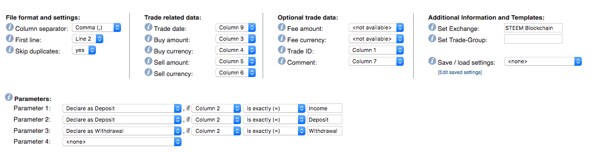

This is an import script for getting STEEM transactions into the CoinTracking.info site.

[CoinTracking](https://cointracking.info) is a portfolio website for tracking cryptocurrency assets. They have lots of exchanges and blockchains already integrated with the site to import automatically, but [STEEM](https://steem.io/) is not one of them. However, they do have a "Custom Exchange Import" option to add in different exchanges that don't have a dedicated import option.

This script uses the [`steem-js`](https://github.com/steemit/steem-js) library to make a connection to the STEEM blockchain, fetches all transactions for a given user, and converts it to a CSV file that can be imported into CoinTracking.

# Usage
This script requires Node to run; either install Node locally and run

```
npm install
node app.js myUsername
```

or, if you wish to use Docker as a way to containerize the process:

```
docker run -it --rm -v "$PWD":/app -w /app node:8 npm install
docker run -it --rm -v "$PWD":/app -w /app node:8 node app.js myUsername
```

In either case, replace `myUsername` with the STEEM user you wish to make a report for. Since STEEM data is completely open, there's no login credentials needed to get a full transaction report on any user.

Either process will create a `steem-transactions.csv` file in the root folder of the project (alongside the `app.js` file). Head to the [Custom Import](https://cointracking.info/import/custom/) screen of CoinTracking (Enter Coins > Bulk Imports > Custom Exchange Import) and select that CSV file as the target.


Click the "Continue to Import" button to progress to the next screen of the import wizard, where you'll have to set some preferences on how to import the data:

- **Column separator:** Comma
- **First Line:** Line 2
- **Trade date:** Column 9
- **Buy amount:** Column 3
- **Buy currency:** Column 4
- **Sell amount:** Column 5
- **Sell currency:** Column 6
- **Trade ID:** Column 1
- **Comment:** Column 7
- **Set Exchange:** "STEEM Blockchain" (or whatever you want to identify this import as)

Under "Parameters", drop down the "`<none>`" option and pick "Declare as Deposit", then pick "Column 2" from the drop-down that appears, and put "Income" in the text box. Repeat for "Deposit", and create another one for "Withdrawal". When done, your import settings should look like:



You can use the "Save/load settings" option on the right to save this import setup for future use.

The script uses the STEEM blockchain transaction ID as the unique identifier for each transaction, so re-running the script in the future will create a CSV with all transactions, but you can safely import the whole file into CoinTracking, since it will notice the same identifier (assuming you set the "Trade ID" parameter correctly, and have the "Skip duplicates" option set to "yes") and not re-import that transaction.

# Caveats
CoinTracking doesn't have a "STEEM Power" (SP) or "Vests" currency, so tracking Steem Power can't be done treating it as a currency. However, the way STEEM Power works on the STEEM blockchain is that it's just STEEM that's staked (held in a different location). So, you can track it on CoinTracking as the STEEM currency, and using a different "exchange" to keep it separate.

This import script does set transactions to STEEM power as separate deposit/withdrawal transactions, but due to the nature of the CoinTracking import, they'll appear in the same "exchange" after import. So, after importing, search for the phrase "From STEEM" in the comment field, and you'll find all the "Deposit" actions that should have their "exchange" value modified to be "STEEM Power" or the like.

Also, when importing into CoinTracking, the only option for incoming funds is "Deposit" (no separation of Income from a transaction). So, all author curation and comment curation rewards are set to "Deposit" by default. To easily find those to set them to "Income", search for "Claiming reward balance" in the comment field.

Of those "reward balance" ones, the ones that are "Claiming reward balance - Power" are the ones that are denoted in the STEEM currency, but were claimed directly to STEEM Power (change their "exchange" to "STEEM Power" to separate them out).
